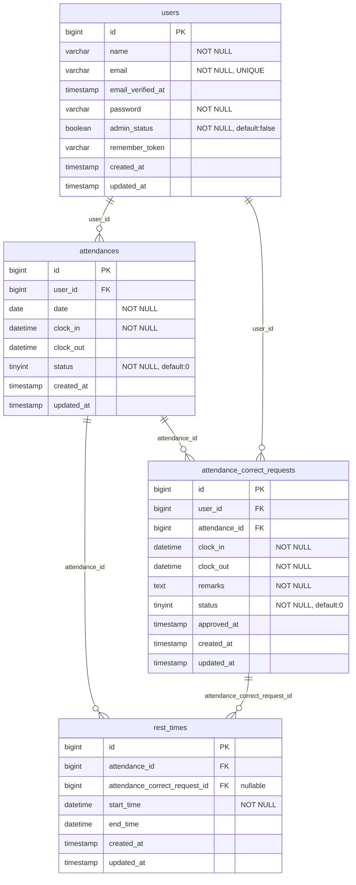

# アプリケーション名
勤怠管理アプリ

## 環境構築

### Docker・Laravel環境構築
* git clone git@github.com:rikom20/attendance-app.git
* cp .env.example .env
* composer install
* ./vendor/bin/sail up -d　(※ alias 設定済みの場合は sail up -d でも可,以下同)
* ./vendor/bin/sail artisan key:generate
* ./vendor/bin/sail npm install
* ./vendor/bin/sail npm run dev

### マイグレーションとダミーデータの投入
* ./vendor/bin/sail artisan migrate
* ./vendor/bin/sail artisan db:seed

### ダミーデータ（ログイン情報）
| 区分 | メールアドレス | パスワード | 備考 |
|---|---|---|---|
| 一般ユーザー1 | user1@example.com | password | メール認証済み。過去5ヶ月分＋当月分の勤怠ダミーデータあり |
| 一般ユーザー2 | user2@example.com | password | メール認証済み |
| 管理者ユーザー | user3@example.com | password | admin_status: true |

## 使用技術（実行環境）
* PHP 8.5.9
* Laravel 10.50.3
* MySQL 8.4
* Laravel Sail（Docker）
* Laravel Fortify（認証機能）

## ER図

## URL
* 会員登録画面：http://localhost/register
* ログイン画面：http://localhost/login
* 管理者ログイン画面：http://localhost/admin/login
* phpMyAdmin：http://localhost:8080/